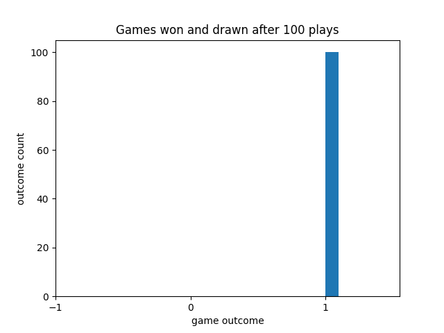

# Solving Tic Tac Toe using Minimax with Alpha Beta Pruning

## Preface

This project was created for assessment one of AI for Games as part of the MSc Computer Games Programming at Goldsmiths, University of London.

I have created a small Tic-Tac-Toe implementation using Python and Numpy where both players are controlled by AI.

One AI moves randomly, whilst another moves using a minimax function. Althought the application does not have any graphics, it does
output a list of the number of games played. Here is what a run of 100 games turned out where player 1 was using minimax, and player 2 was using random movement.

